#Hasil dari Soal Odoo Developer

Odoo Version: 16
OS          : Ubuntu 24.04.3 LTS

Soal:

1. A)

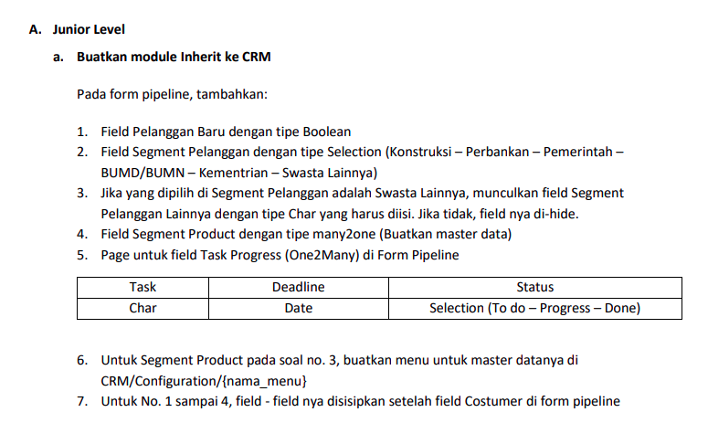

Checklist:
1. Karena saya menggunakan versi community, dan ketika "NEW" perlu Token yang dimana berbayar, perlu checklist "LEAD" di settingan CRM terlebih dahulu
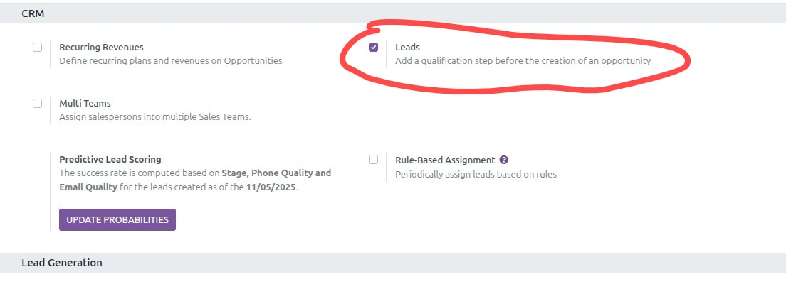
2. Lalu setelah itu pilih menu Leads
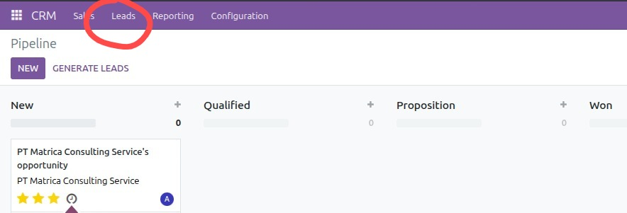
3. Lalu Klik "New"
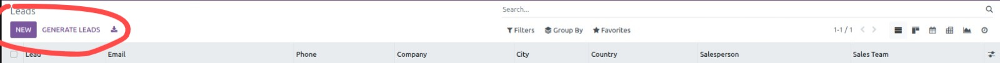
Jawaban:
1. Jawaban Untuk nomor 1 dan 7
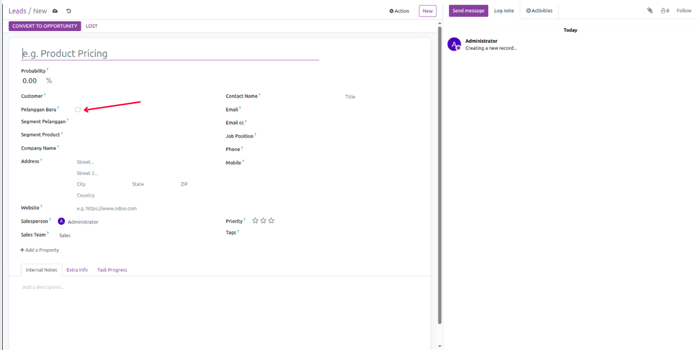
2. Jawaban untuk nomor 2:
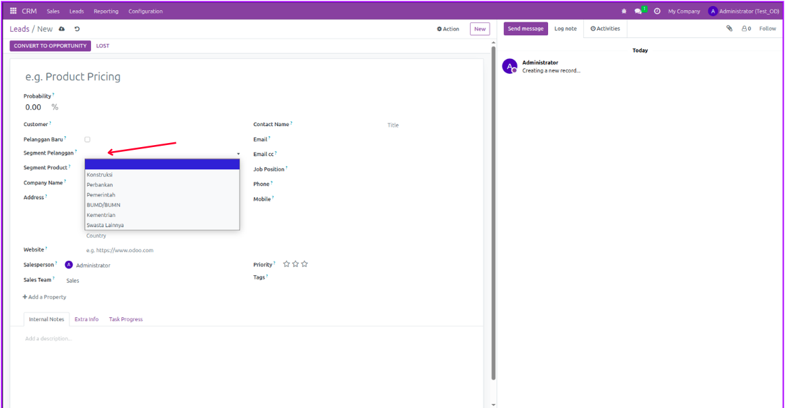
3. Jawaban untuk nomor 3:
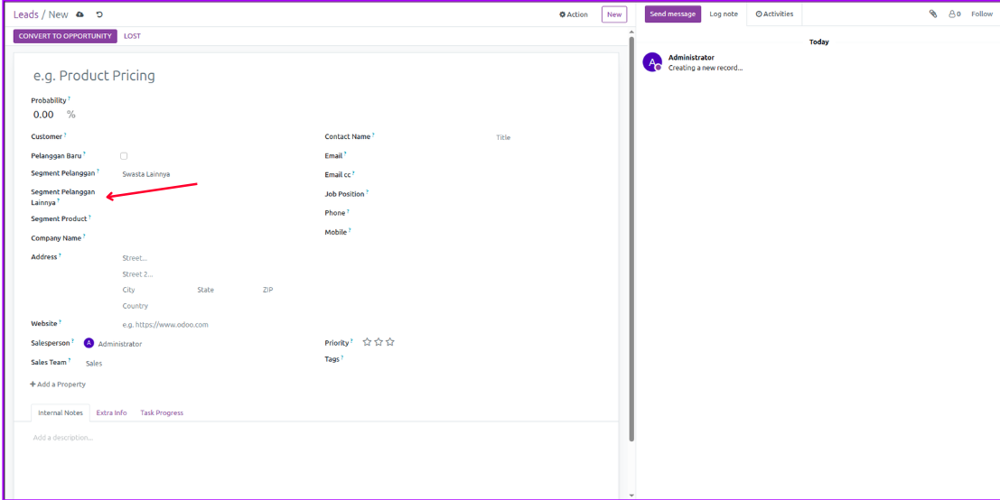
4. Jawaban untuk nomor 4:
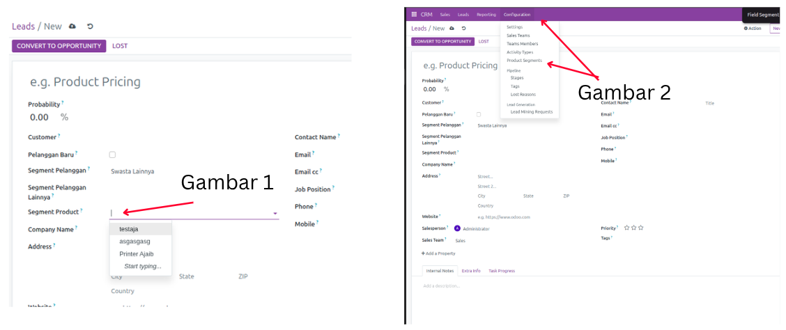
5. Jawaban untuk nomor 5:

Soal Untuk 1B:

1. B):
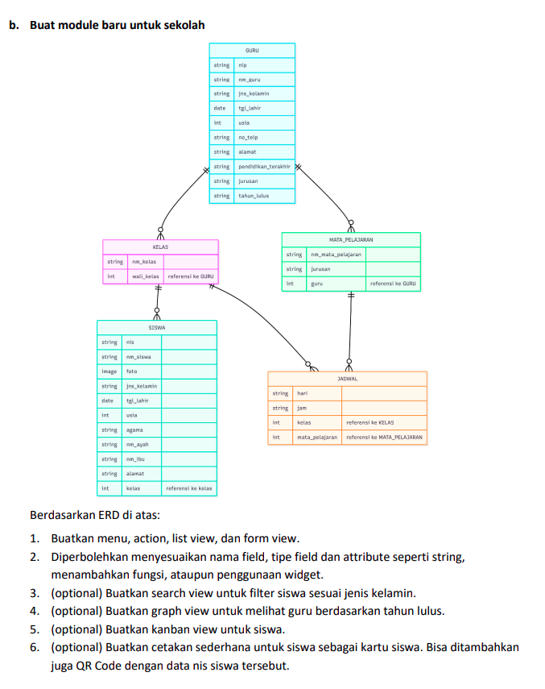

Checklist:
1. Pilih Menu Sekolah
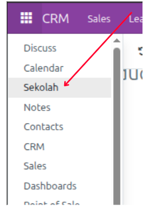\

Jawaban soal B:
1. Untuk nomor 1 , atau bisa di cek langsung via debug mode, nanti klik icon debug, bisa dicek "EDIT view list atau form view"
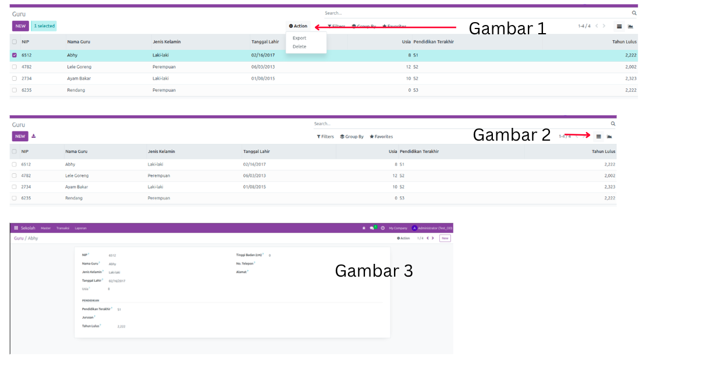
2. Bisa di cek By code
3. Untuk nomor 3:
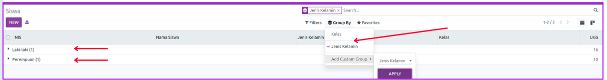
4. Untuk nomor 4:
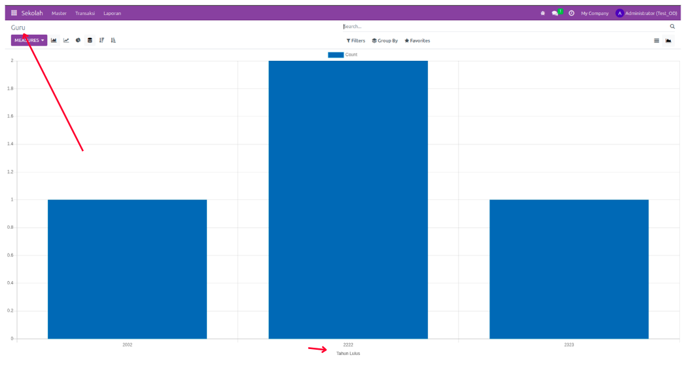 
5. Untuk nomor 5: 
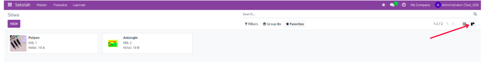
6. Untuk Nomor 6:

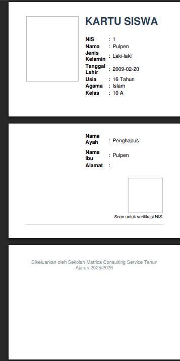
